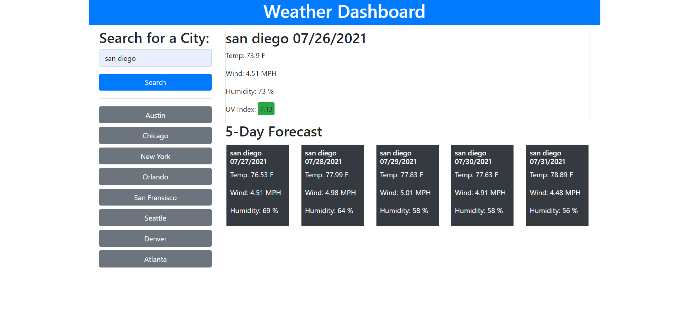

# five-day-forecast-dashboard

# Overview
This application is a dashboard to display the weather results for several major cities

When you search a city name using the form on the top left, the dashboard on the right hand side is updated. 

If you click a button on the left hand side, the dashboard is updated. 

This data is pulled from Open Weather's One Call API using the fetch function. 
https://openweathermap.org/api/one-call-api

## URL 
Live Application: https://zacktmiller92.github.io/five-day-forecast-dashboard/index.html

Repository URL: https://github.com/zacktmiller92/five-day-forecast-dashboard

## Application Screenshot
